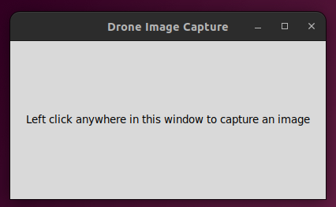
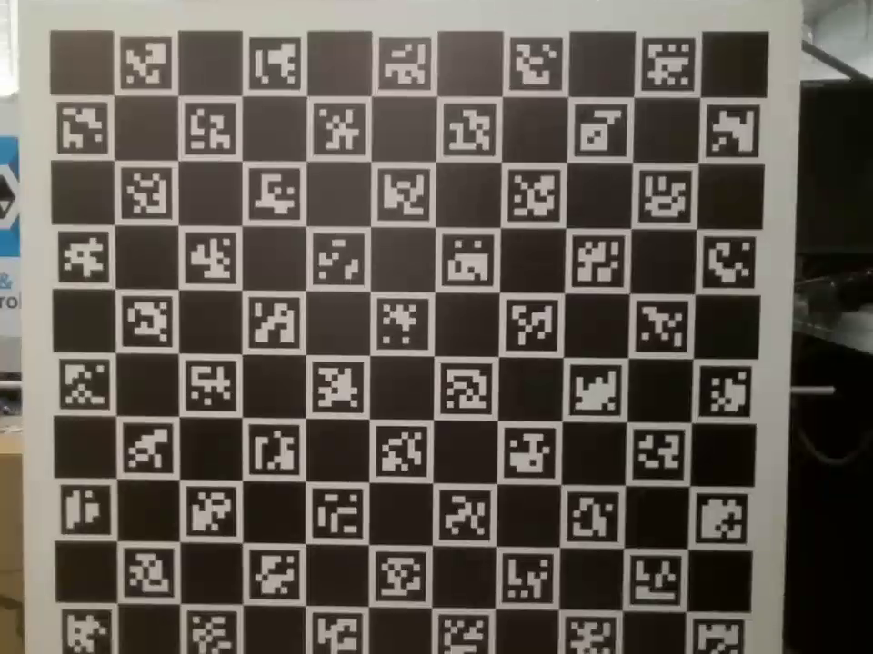
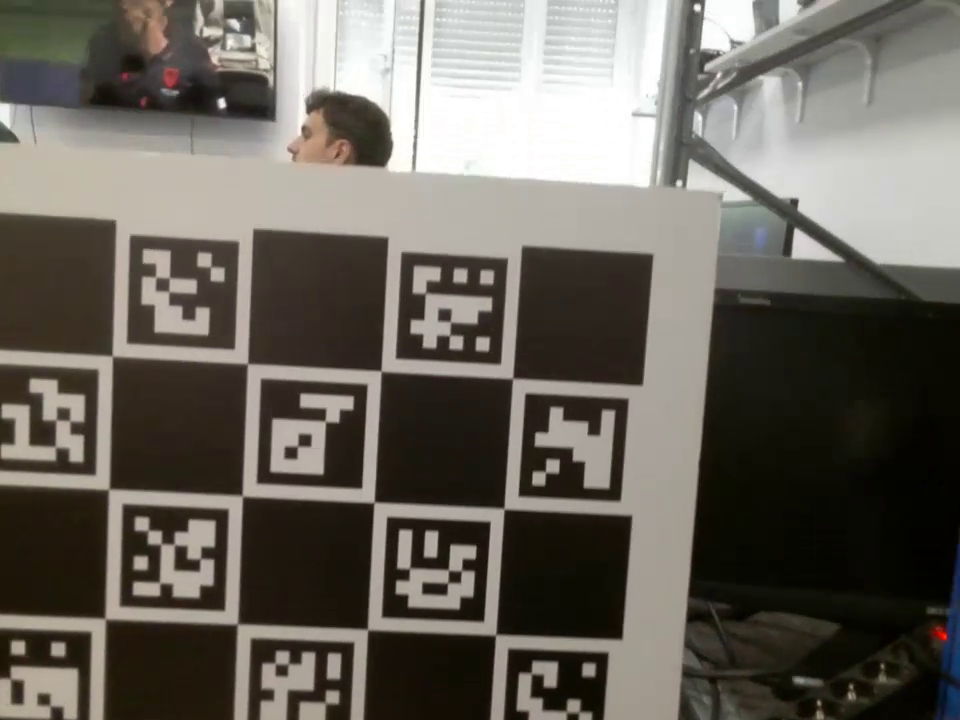
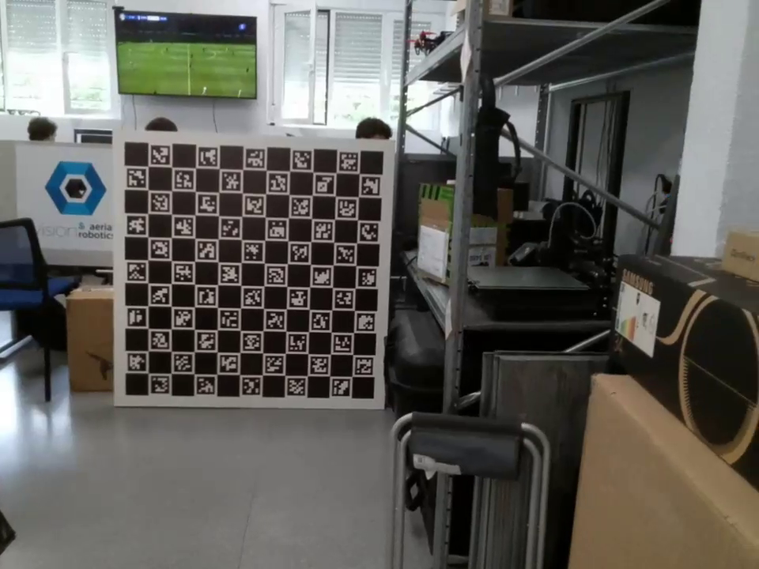
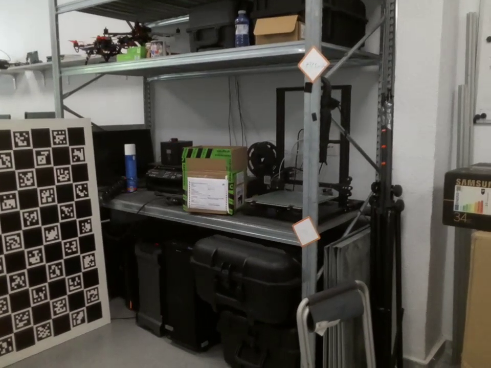

# Project Cam Calibration

## Mission

The folder contains a number of Python3 scripts which will be used to calibrate a camera inside a given drone.

 
### Images

With the given Python3 scripts, a few of them allow one to obtain a number of images in PNG format. 

* [mission_Test.py](mission_project/mission_Test.py)
* [take_image.py](mission_project/take_image.py)
* [save_image.py](mission_project/save_image.py)

#### mission_Test.py
The use of **mission_Test.py** allows for image capturing whilst being fully autonomous. This is done by giving the script a number of paramaters before running the code. Once the parameters are given, the script will produce a path through some backend Python3 scritps; which can be found inside the folder. Once script is running, drone will follow path and at each point the drone pauses, an image will be uploaded to the wanted directory. Once path is finished, the option to repeat path will be shown, if one chooses not to repeat path, drone will land safely and shutoff.

Below is an example of how to run the script inside the terminal. 

```bash
python3 mission_Test.py
```
Below is the list of all arguments withing the script.

```bash
    parser = argparse.ArgumentParser(description='Obtain bounds for drone')

    parser.add_argument('--x_max', type=float, default=0.60, help='Max x bound')
    parser.add_argument('--x_min', type=float, default=0.60, help='Min x bound')

    parser.add_argument('--y_dist', type=float, default=1.0, help='y bound')

    parser.add_argument('--z_max', type=float, default=0.5, help='Max z bound')
    parser.add_argument('--z_min', type=float, default=0.5, help='Min z bound')

    parser.add_argument('--num_seg', type=int, default=3, help='Number of segments')

    parser.add_argument('--num_img', type=int, default=3, help='Number of images')

    parser.add_argument('--yaw_angle', type=float, default=1.57,
                        help='Yaw drone will take path with')
```

#### take_image.py
The use of **take_image.py** allows one to capture images while having full control of the drone. The whole point of this script is to allow one to manoeuvre the drone manually and take images when doing so. When running the script, a small box will appear. This box will allow for the user to have interface with the drone. When one interferes with the system, an image will be uploaded to its wanted directory. Once image capturing is completed, close box to kill script.

Below is an example of how to run the script.

```bash
python3 take_image.py
```
Once the line of code is ran inside the terminal, box should appear, like the one below. Left click it to save an image.



#### save_image.py
The use of **save_image.py** allows for image capturing while having full controll of the drone. Though with this script, one will not be able to elect when an image is uploaded to its wanted directory. Once the script is ran, images will automatically upload to the directory of choice and will only shutoff once script is killed. 


Below is an example of how to run the script.

```bash
python3 save_image.py
```

### Examples of Images
When doing a calibration, the images used for the calibration are vital. When taking images, take images at different distances and angles. This will allow for the calibration to have a precise reading of the charuco. Below are examples of different images used for the same calibration.










### Calibration
Inside the folder, two Python3 scripts help with the calibration process.

* [charucoCalib.py](mission_project/charucoCalib.py)
* [camera_info.py](mission_project/camera_info.py)

#### charucoCalib.py
The script **charucoCalib.py** allows for calibration of the images to occur. Takes in images from a specified directoy and follows a calibration process. Once completed, information regarding the calibration will be obtained. Note, when running calibration with large number of images could result in code taking longer to run.

#### camera_info.py
The script **camera_info** helps the user have info regarding the calibration to be formatted in a seperate yaml file. This script uses **charucoCalib** to obtain information regarding the calibration.

Below is an exmaple of how to run the script inside the terminal. Argument "data_dir" allows for the script to know where to take in images from.


```bash
python3 camera_info.py --datadir "./drone_images_auto/"
```

 Below is an example of the yaml file writing that would contain all the necessary information for the camera calibration. Note K, R, P are matrices flattened into a list.

```plaintext
Calibration parameters:

/**:
  ros__parameters:
    camera:
      image_width: 1920
      image_height: 1080
      camera_name: camera
      camera_matrix:
        rows: 3
        cols: 3
        data: [761.0057975745207, 0.0, 1001.3167405267623, 0.0, 761.0057975745207,
          513.5596034596441, 0.0, 0.0, 1.0]
      distortion_model: plumb_bob
      distortion_coefficients:
        rows: 1
        cols: 5
        data: [0.8974843864360182, 0.14011134541456177, -0.00025846537470598866, 0.00016483369094559268,
          0.0019942725914891325]
      rectification_matrix:
        rows: 3
        cols: 3
        data: [1.0, 0.0, 0.0, 0.0, 1.0, 0.0, 0.0, 0.0, 1.0]
      projection_matrix:
        rows: 3
        cols: 4
        data: [761.0057975745207, 0.0, 1001.3167405267623, 0.0, 0.0, 761.0057975745207,
          513.5596034596441, 0.0, 0.0, 0.0, 1.0, 0.0]
```
